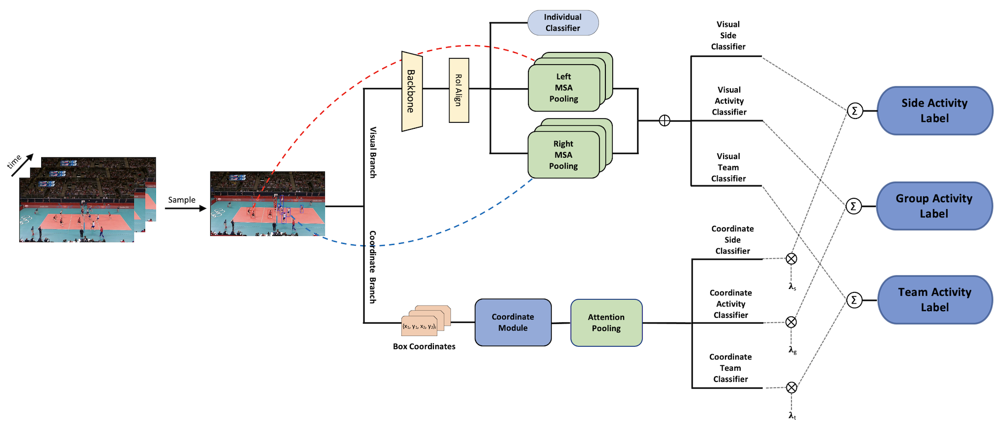

# DECOMPL: Decompositional Learning with Attention Pooling for Group Activity Recognition from a Single Volleyball Image

This is an official implementation of [DECOMPL: Decompositional Learning with Attention Pooling for Group Activity Recognition from a Single Volleyball Image](https://arxiv.org/abs/2303.06439). In this repository, we provide PyTorch code for training and testing as described in the paper. 



## Preparing Dataset

1. Download VD from following link: [Volleyball dataset](https://drive.google.com/drive/folders/1rmsrG1mgkwxOKhsr-QYoi9Ss92wQmCOS).
2. Unzip the dataset (~60 GB) file into a directory named `data` and set its name to `volleyball_videos`
3. Download the file `tracks_normalized.pkl` from [cvlab-epfl/social-scene-understanding](https://raw.githubusercontent.com/wjchaoGit/Group-Activity-Recognition/master/data/volleyball/tracks_normalized.pkl) and put it into the directory `data`
4. Finally, place DECOMPL and our reannotations on the same directory


## Getting Started
1. **Conda (Recommended)**: 
    ```shell
    conda env create -n DECOMPL
    conda activate DECOMPL
    ```

2. **Pip**
    ```shell
    pip install -r requirements.txt
    ```

3. **Training and Validation**: Modify `test_only` argument in `/scripts/run_model_volleyball.py` to train or validate. To use the pretrained weights set `load_path` to `checkpoint_weights_volleyball_half.pth`
    ```shell
    cd PROJECT_PATH 
    python scripts/run_model.py
    ```

4. **Additionally, Training and Validation for Collective Activity Dataset**: Follow the same instructions as for the Volleyball Dataset on the scripts `/scripts/run_model_collective.py` and pretrained weights `checkpoint_weights_collective_half.pth`

Note: The weights provided are converted to half precision due to size constraints.

@<font color="red">article</font>{
<font color="purple">demirel2023decompl</font>,
<font color="blue">title</font>={<font color="blue">DECOMPL: Decompositional Learning with Attention Pooling for Group Activity Recognition from a Single Volleyball Image</font>},
<font color="blue">author</font>={<font color="blue">Demirel, Berker and Ozkan, Huseyin</font>},
<font color="blue">journal</font>={<font color="blue">arXiv preprint arXiv:2303.06439</font>},
<font color="blue">year</font>={<font color="blue">2023</font>}
}